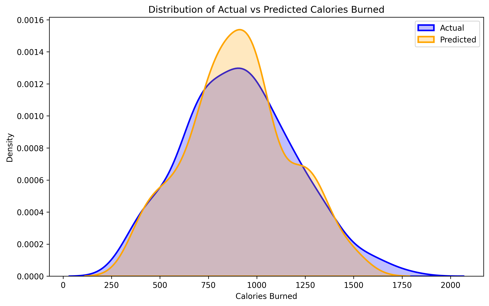
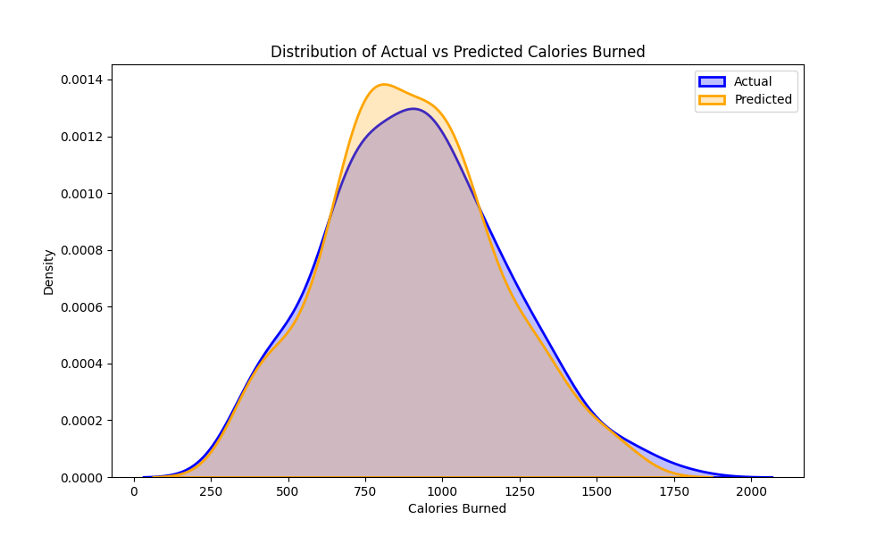

# Gym Members Exercise Patterns Analysis

## Overview
This project analyzes the exercise patterns of gym members to understand the relationships between various factors and the target variable, `Calories_Burned`. The analysis includes exploratory data analysis (EDA) and regression modeling using both continuous and mixed features.

## Dataset
The dataset used in this project can be found on Kaggle: [Gym Members Exercise Dataset](https://www.kaggle.com/datasets/valakhorasani/gym-members-exercise-dataset/data)

## Steps Performed

### 1. Exploratory Data Analysis (EDA)
- **Dataset Loading**: The dataset `gym_members_exercise_tracking.csv` was loaded into a pandas DataFrame.
- **Data Preprocessing**:
  - Continuous variables were normalized using `MinMaxScaler`.
  - Categorical variables were analyzed using one-way ANOVA to assess their relationship with the target variable.
- **Visualization**:
  - Scatter plots and regression lines were created for continuous variables against `Calories_Burned`.
  - Boxplots were used to analyze categorical variables.
  - A heatmap was generated for the correlation matrix of continuous features.
- **Statistical Analysis**:
  - Pearson correlation coefficients and p-values were calculated for continuous variables with the target variable.
  - One-way ANOVA was performed for categorical variables (`Workout_Frequency (days/week)` and `Experience_Level`) to assess their significance.

### 2. Regression Analysis with Continuous Features
- **Features Used**:
  - `Session_Duration (hours)`
  - `Fat_Percentage`
- **Model**:
  - Polynomial regression with degrees ranging from 1 to 15.
- **Evaluation**:
  - K-fold cross-validation was used to calculate average R² scores and Mean Absolute Error (MAE) for each degree.
  - The best degree was selected based on the highest R² score and lowest MAE.
- **Results**:
  - Test Set R² Score: **0.838**
  - Test Set Mean Absolute Error: **91.56**
  - The best polynomial degree achieved a high R² score and low MAE, indicating strong predictive performance.
  - However, the model showed signs of overfitting due to its complexity.
  - 

### 3. Regression Analysis with Mixed Features
- **Features Used**:
  - Continuous: `Session_Duration (hours)`, `Fat_Percentage`
  - Categorical: `Workout_Frequency (days/week)`, `Experience_Level`
- **Model**:
  - Random Forest Regressor.
- **Evaluation**:
  - Test Set R² Score: **0.816**
  - Test Set Mean Absolute Error: **97.84**
  - The model was evaluated using R² score and MAE on the test set.
  - KDE plots, scatterplots, and residual plots were used to visualize the model's performance.
  - The Random Forest model captured the overall distribution of the target variable better than the polynomial regression model.
  - However, its R² score and MAE were slightly worse, likely due to the inclusion of categorical variables with less predictive power.
  - 

## Conclusions
1. **EDA Insights**:
   - `Session_Duration (hours)` and `Fat_Percentage` showed strong correlations with `Calories_Burned`.
   - Categorical variables (`Workout_Frequency (days/week)` and `Experience_Level`) were statistically significant based on ANOVA tests but contributed less predictive power compared to continuous variables.

2. **Model Comparisons**:
   - The polynomial regression model achieved better R² and MAE scores due to its focus on strongly correlated continuous features but showed signs of overfitting.
   - The Random Forest model provided a more generalized representation of the data and better aligned with the actual distribution but had slightly worse performance metrics.

3. **Trade-offs**:
   - The choice of model depends on the use case. For precise predictions, the polynomial regression model may be preferred. For a more generalized understanding of the data, the Random Forest model is better suited.

## Tools and Libraries Used
- Python
- pandas
- numpy
- matplotlib
- seaborn
- scikit-learn
- scipy

## Output
- Visualizations and statistical analyses provide insights into the relationships between variables.
- Regression models demonstrate the trade-offs between complexity and generalization in predictive modeling.